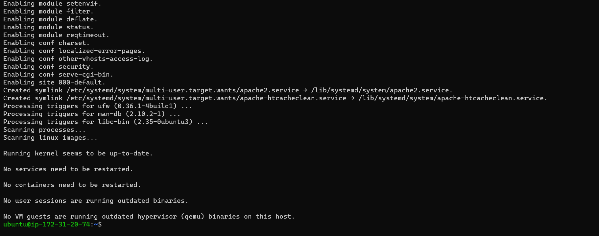
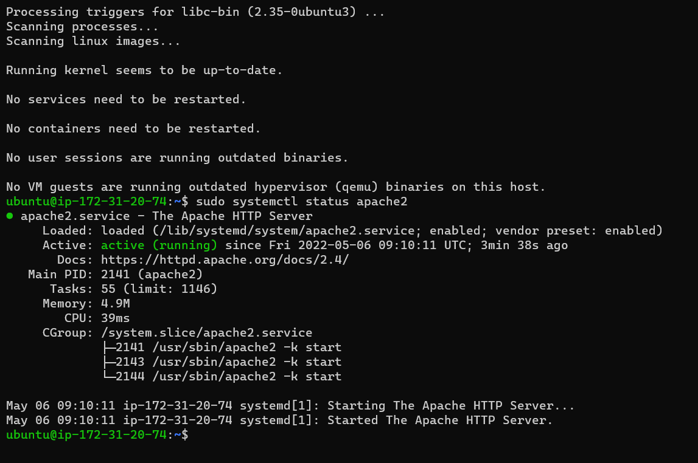
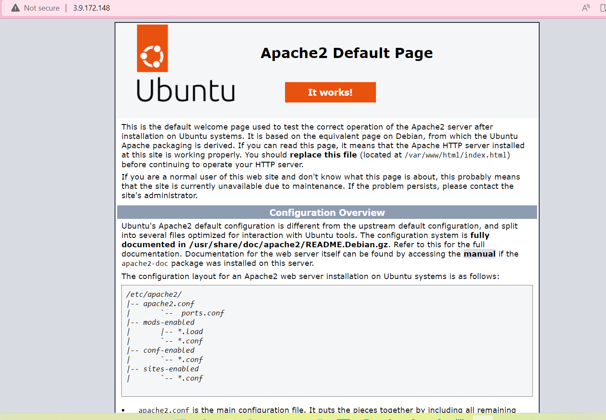
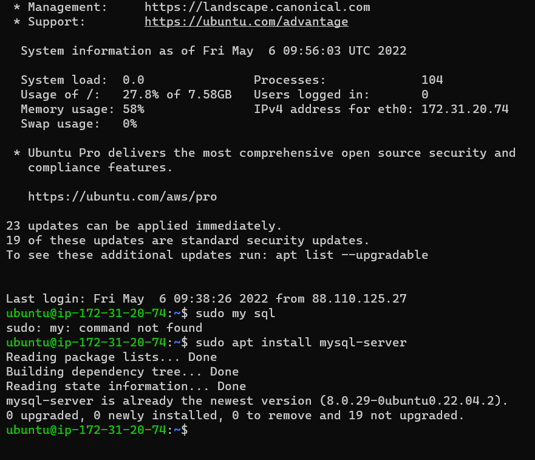

# INSTALLING APACHE AND UPDATING THE FIREWALL

'sudo apt update'

'sudo apt install apache2'

'sudo systemctl status apache2'

<Apache2 default page>(http://3.9.172.148)

## INSTALL MY SQL

'sudo apt install mysql-server'

'sudo mysql_secure_installation'

sudo mysql
add image

